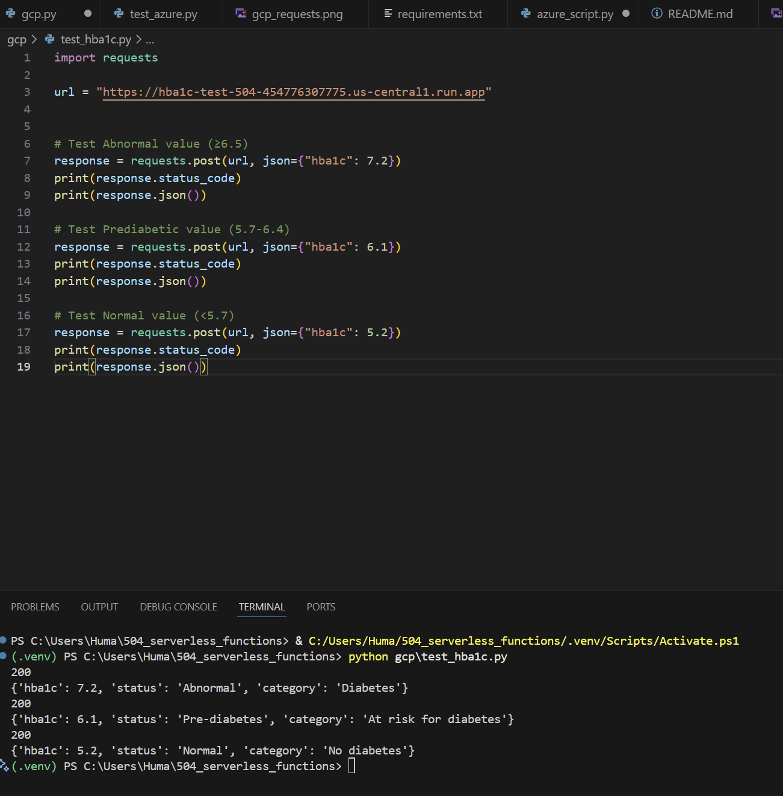
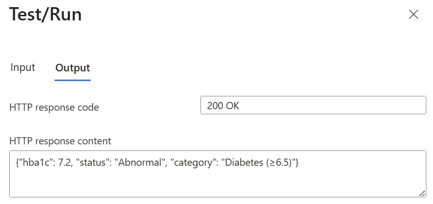
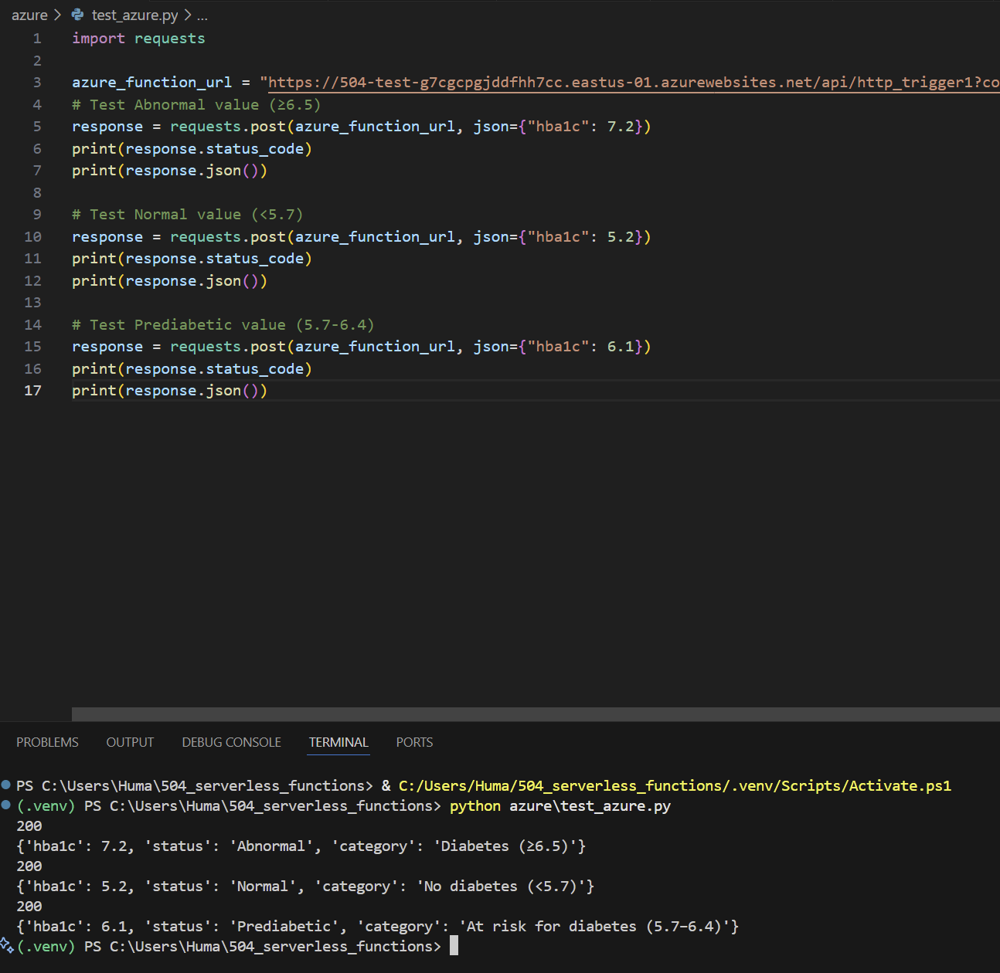
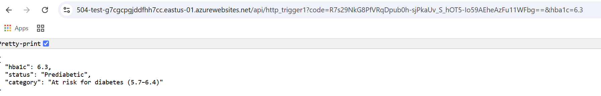

# Multi‑Cloud Serverless Function (HbA1c Levels)
The purpose of this assignment is to implement the same HTTP serverless function in two clouds. Our function will accept JSON input values describing HbA1c levels. Given an input, "abnormal, normal, or at risk" will be produced in **Google Cloud Platform and Azure**. 

### Lab Rules
The American with Disabilities Act (ADA) has recently recommended HbA1c with a cut-point ≥6.5% for diagnosing diabetes. 
- Therefore, lab values with a HbA1c level **greater than or equal to 6.5** will have an `abnormal test result` and a diagnosis of `diabetes`. 
- Lab values **less than 5.7** will have a `normal test result` and lab values between 5.7 and 6.4 will have an `At risk result`.
- Source: American Diabetes Association Professional Practice Committee; 2. Diagnosis and Classification of Diabetes: Standards of Care in Diabetes—2025. Diabetes Care 1 January 2025; 48 (Supplement_1): S27–S49. https://doi.org/10.2337/dc25-S002 

## Google Cloud
- **Name**: hba1c-test-504
- **Region**: us-central1 
- **Base image**: Python 3.13 (Ubuntu 22)
- **Authentication**: Allow public access
- **Networking**: All (Allow direct access to your service from the internet)
- **Endpoint Link**: https://hba1c-test-504-454776307775.us-central1.run.app 

### GCP Deployment Steps
1. Logged into Google Cloud and ensured students billing was turned on.
2. Searched: `Cloud run` then selected "Write a function, Use an inline editor to create a function" 
3. Assigned the service a name (in our case hba1c-test-504) and chose a region (us-central1)
4. Selected **Python 3.12** for runtime. 
5. For authentication selected: **Allow Public Access**
6. Billing: **Request based**
7. Auto scaling: 0 for minimum number of instances and 1 for maximum number of instances
8. Ingress: All 
9. Kept "Function entry point" to `hello_http` and named our key `hba1c` and wrote our code (which is stored in `gcp.py` file) into the source. 
10. Clicked “Save and Deploy” to update code. 
11. Copied the endpoint URL (used later in `requests.post()` tests).

### POST Requests
We were able to input two values and run them in our `test_hba1c.py` file:

Value #1 
- Value: `7.2`
- Status: `Abnormal`
- Category: `Diabetes (>=6.5)` 

Value #2
- Value: `5.2`
- Status: `Normal`
- Category: `No diabetes (<5.7)` 

Value #3
- Value: `6.1`
- Status: `Prediabetes`
- Category: `At risk for diabetes (5.7–6.4)`

When running this on VS code we put in the following command: `python azure\test_hba1c.py` 

### GET Request
When running this on the URL you can type: `?hba1c=(a value)` and it will generate a response for you. 
- For example:

## Azure 
- **Name**: 504-test
- **Location**: East US 
- **Operating System**: Linux
- **Authentication**: Allow public access
- **Networking**: All (Allow direct access to your service from the internet)
- **Endpoint Link**: https://504-test-g7cgcpgjddfhh7cc.eastus-01.azurewebsites.net/api/http_trigger1?code=R7s29NkG8PfVRqDpub0h-sjPkaUv_S_hOT5-Io59AEheAzFu11WFbg== 

### Azure Deployment Steps
1. Logged into Azure and I selected my resource group `504`
2. I checked my resource group location: East US (this means we need to create a function app with East US as the location).
3. I clicked on `Function App` > Create> Consumption (this is the cheapest option)
4. Subscription: **Azure for Students** and Resource Group **504**
5. Function name: **504-test** and OS is **Linux**
6. Runtime slack: **Python version 3.12**
7. Region: **East US**
8. I kept everything else as is, basic authentication: **Disabled**
9. If deployment passes it'll say **your deployment is complete**
10. Then click on **Go to resource**> **Create Function**> **HTTP Trigger** 
11. Provide a function name: `http_trigger1` 
12. Then begin adding in code (stored in `azure_script.py` file). We named our key `hba1c` 
13. Clicked “Save” to update code and `Test/Run` 
14. In the query parameters I added in `hba1c` for name and for value `7.2` to test it and I copied the **default-function key URL** which was used later in `requests.post()` tests.

### POST Requests
We were able to input two values and run them in our `test_azure.py` file:

Value #1 
- Value: `7.2`
- Status: `Abnormal`
- Category: `Diabetes (>=6.5)` 

Value #2
- Value: `5.2`
- Status: `Normal`
- Category: `No diabetes (<5.7)` 

Value #3
- Value: `6.1`
- Status: `Prediabetes`
- Category: `At risk for diabetes (5.7–6.4)`

- When running this on VS code we put in the following command: `python azure\test_azure.py` 

### GET Request
- When running this on the URL you can type: `&hba1c=(a value)` and it will generate a response for you. 

## Logs and Monitoring 
- **In GCP**: This shows our functions/commands and we can see why our function did not work. 
- **In Azure**: Logs appear at the bottom or at the top under "logs" this shows our successful commands/functions. 

## Comparison between GCP and Azure
I prefer GCP because in Azure, to create a serverless function we had to check the location of our resource group and make sure our serverless function was also made using the same region. This was frustrating because it took multiple attempts for me to get my function to work. While in GCP, you can use any region that has the server available. I also like GCP's layout it is neat and user friendly making deployment faster and easier. 