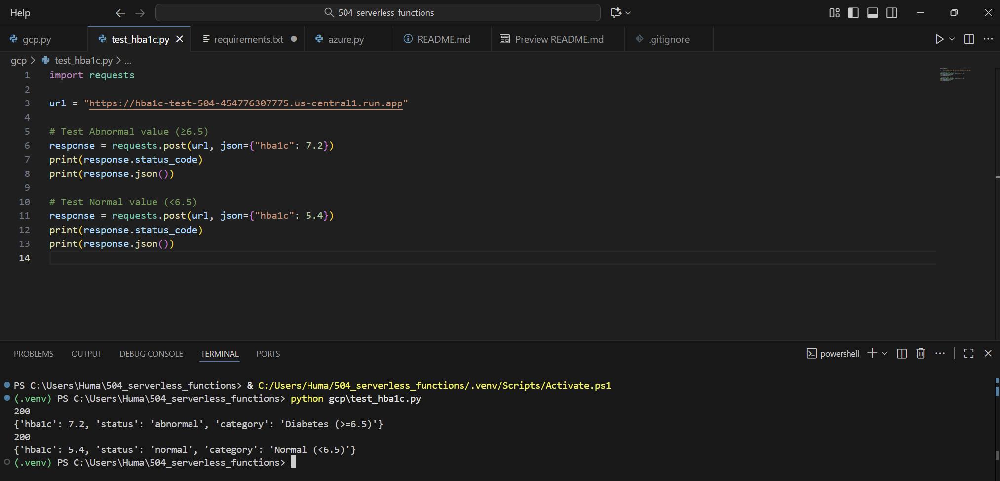
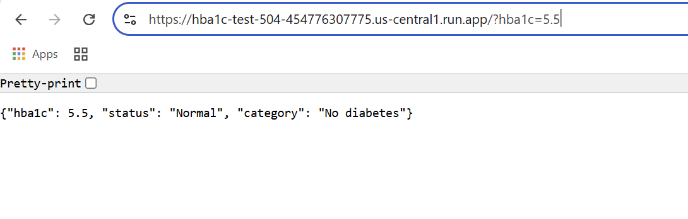

# Multi‑Cloud Serverless Function (HbA1c Levels)
The purpose of this assignment is to implement the same HTTP serverless function in two clouds. Our function will accept JSON input values describing HbA1c levels. Given an input, a binary classifier (abnormal or normal) will be produced in **Google Cloud Platform and Azure**. 

### Lab Rules
The American with Disabilities Act (ADA) has recently recommended HbA1c with a cut-point ≥6.5% for diagnosing diabetes. 
- Therefore, lab values with a HbA1c level **greater than or equal to 6.5** will have an `abnormal test result` and a diagnosis of `diabetes`. 
- Lab values **less than 5.7** will have a `normal test result`. 
- Source: American Diabetes Association Professional Practice Committee; 2. Diagnosis and Classification of Diabetes: Standards of Care in Diabetes—2025. Diabetes Care 1 January 2025; 48 (Supplement_1): S27–S49. https://doi.org/10.2337/dc25-S002 

## Google Cloud
- **Name**: hba1c-test-504
- **Region**: us-central1 
- **Base image**: Python 3.13 (Ubuntu 22)
- **Authentication**: Allow public access
- **Networking**: All (Allow direct access to your service from the internet)
- **Link**: https://hba1c-test-504-454776307775.us-central1.run.app 

We were able to input two values and run them in our `test_hba1c.py` file:

Value #1 
- Value: `7.2`
- Status: `Abnormal`
- Category: `Diabetes (>=6.5)` 

Value #2
- Value: `5.2`
- Status: `Normal`
- Category: `No diabetes (<5.7)` 

Value #3
- Value: `6.1`
- Status: `Prediabetes`
- Category: `At risk for diabetes (5.7–6.4)`

When running this on the URL you can type: ?hba1c(a value) and it will generate a response for you. 
For example:

